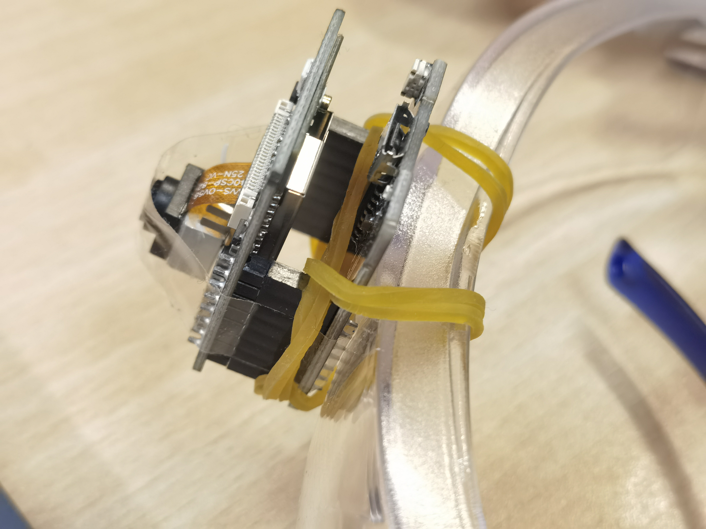

# BGM For Your Life

## 项目简介

本项目旨在通过实时捕捉用户眼前的场景，生成符合情境的背景音乐（BGM）。通过安装在眼镜上的摄像头获取视频流，结合图像描述模型、语言模型和音乐生成模型，系统能够根据场景生成适合的音乐，并通过蓝牙或音响播放。项目的主要目标是为用户的生活场景提供个性化的配乐，提升用户体验。

## 项目结构

项目的总体框架如下：

1. **视频流获取**：通过安装在眼镜上的ESP32摄像头获取实时视频流。
2. **图像处理**：对视频流中的帧进行清晰度筛选，提取代表图片。
3. **图像描述**：使用图像描述模型（mPLUG-Owl3）生成图片的文字描述。
4. **语言模型处理**：通过双层LLM模型（Llama3.2-1B）生成音乐风格和乐器的提示词。
5. **音乐生成**：使用音乐生成模型（facebook/musicgen-small）生成符合场景的音乐。
6. **音乐播放**：通过pygame库将生成的音乐合成为音乐流并播放。


## 模型部署

在使用 `caption_llama_generate.py` 前，需要本地部署以下模型：

1. **图像描述模型**：`mPLUG/mPLUG-Owl3-2B-241014`
   - 下载地址：[Hugging Face](https://huggingface.co/mPLUG/mPLUG-Owl3-2B-241014)

2. **音乐生成模型**：`facebook/musicgen-small`
   - 下载地址：[Hugging Face](https://huggingface.co/facebook/musicgen-small)

3. **语言模型**：`Llama3.2-1B`
   - 下载地址：[魔搭社区](https://www.modelscope.cn/models/LLM-Research/Llama-3.2-1B-Instruct)

## 环境配置

以下是项目所需的Python及相关库的版本：

- `torch`: 2.3.0
- `torchaudio`: 2.3.0
- `torchvision`: 0.18.0
- `transformers`: 4.46.3
- `opencv-contrib-python`: 4.7.0.72
- `opencv-python`: 4.8.0.74
- `scipy`: 1.13.1
- `decord`: 0.6.0
- `diffusers`: 0.31.0

## 使用说明

1. **运行代码**：
   - 运行 `caption_llama_generate.py` 以生成音乐：
     ```bash
     python caption_llama_generate.py
     ```

2. **播放音乐**：
   - `caption_llama_generate.py`会将生成wav格式的音频文件可以通过 `wav2music_stream.py` 将其合成为音乐流并播放：
     
     ```bash
     python wav2music_stream.py
     ```

## 硬件制作

### 硬件组件
- **ESP32-CAM**：用于拍摄640*480分辨率的视频流，并通过WiFi传输到电脑。
- **5V小型电池**：为ESP32-CAM供电。
- **护目镜**：作为硬件的载体，ESP32-CAM和电池通过橡皮筋固定在护目镜上。

### 硬件装配步骤
1. **ESP32-CAM安装**：
   - 使用橡皮筋将ESP32-CAM捆绑至护目镜的前端，确保摄像头能够捕捉到用户眼前的画面。
   
2. **电池安装**：
   - 使用橡皮筋将5V小型电池捆绑至护目镜的镜腿处，确保电池能够稳定供电。

3. **连接与调试**：
   - 将ESP32-CAM与电池连接，确保设备能够正常工作。
   - 通过WiFi将ESP32-CAM与电脑连接，确保视频流能够实时传输。

### 硬件示意图
- **图1：ESP32-CAM装配**  
  
  
- **图2：电池装配**  
  

## 项目展示

项目的Demo视频展示了在工作场景和游戏场景中生成背景音乐的效果。

## 项目评价

项目的评价系统从音质、生成时间、与场景匹配度和用户满意度四个方面对生成的音乐进行评估。具体评分标准如下：

| 评价项目     | 评分标准                                                   |
| ------------ | ---------------------------------------------------------- |
| 音质         | 使用信噪比 (SNR) 和 PESQ 指标，1-10 分，分数越高，音质越好 |
| 生成时间     | 测量生成时间，低于预设阈值的时间得高分                     |
| 与场景匹配度 | 人工评估与设定场景标签的匹配度，1-5 分，分数越高匹配度越好 |
| 用户满意度   | 通过用户反馈，基于调查问卷评分，1-5 分，分数越高用户越满意 |

## 总结与展望

本项目通过结合图像描述、语言模型和音乐生成模型，成功实现了根据场景生成背景音乐的功能。未来可以进一步优化模型，增加更多的输入信息（如GPS定位、心率数据）以提高场景描述的准确性，同时改进硬件设计以提升佩戴舒适度和续航能力。

---

**注意**：在使用本项目时，请确保已正确下载并部署所有模型，并按照环境配置安装所需的Python库。